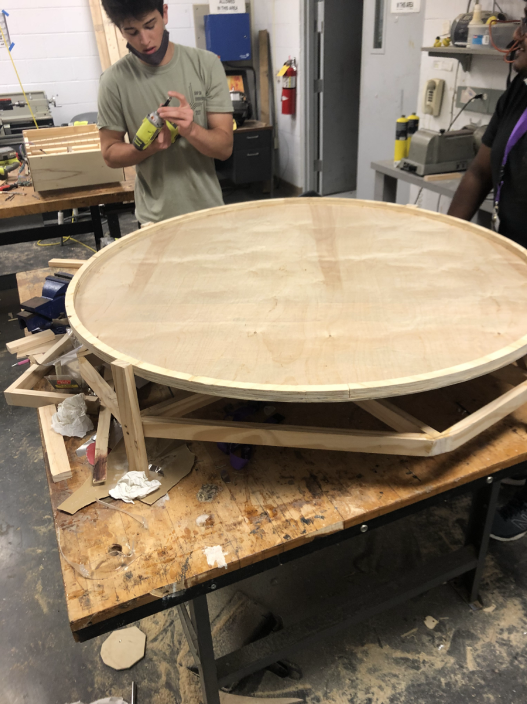
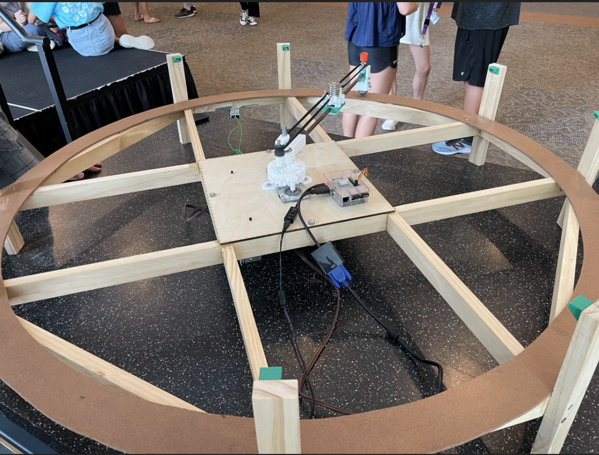
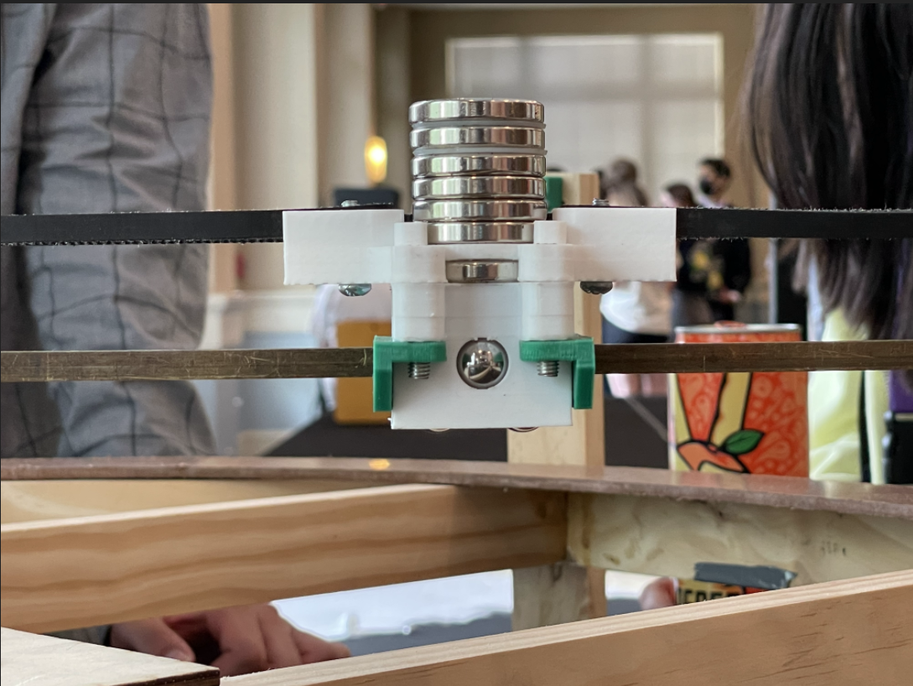
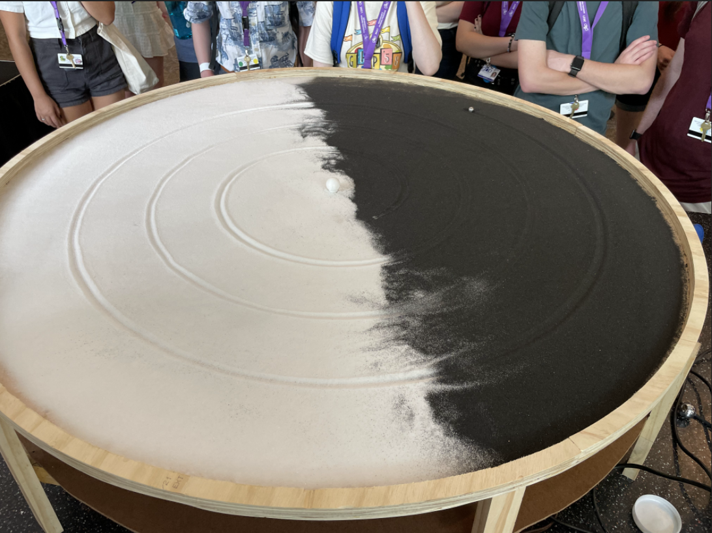

<i>Kinetic art that can simulate virtually any orbit in the universe.</i>

  This "Orbit Simulator" was completed as the capstone project for the engineering concentration at the Governor's Honors Program (GHP). 

<h2>How It Works</h2>

The Orbit Simulator starts with a circular-shaped table built from scratch.  

The table abstracts a system of gears and two motors. One motor spins an axle along a circular track. The other moves a sled fitted with neodymium magnets linearly along a timing belt. With its bidirectional motion, the system has the power to model accurate ellipses.

The neodymium magnets fitted to the sled, which linearly along the axle spinning in a circle. Employing certain physics equations, the code adjusts the distance the sled moves along the timing belt to ensure the eccentricity of the orbit is modeled. The code additionally modulates the velocity of the stepper motors to make the system true to the actual orbit's velocity (scaled down).

To top it off, a tabletop, filled with sand, rests on top of the table's base.In the middle, a static object rests to emulate a central body. Inches away rests a metal ball, which emulates the satellite. When the system is turned on, the neodymium magnets latch onto the metal ball: making the metal ball travel the orbit's path. The metal ball traces the orbit in the sand, allowing viewers to witness what orbits of planets from Mercury to Jupiter look like in real-time, on a physical model. (The system can also create pretty patterns, like spirals).

<h2>Materials</h2>

<ul>
<li>Raspberry Pi 3B+</li>
<li>Stepper Motors</li>
<li>Stepper Motor Drivers</li>
<li>Lots of 3D Printer Filament</li>
<li>Lots of Wood</li>
<li>12 V Power Supply</li>
<li>Limit Switches</li>

</ul>

<h3>Team Members:</h3>
<ul>
  <li>Jatong Su - <a href="https://github.com/js2585">@js2585 (Programming)</a></li>
  <li>Henry Traynor - <a href="https://github.com/HenryTraynor">@HenryTraynor (Mechatronics)</a></li>
  <li>Spencer Hopkins (Mechanical Design)</li>
</ul>

We would like to thank the GHP Engineering Faculty (Mr. Bouchard, Hannah, and Josh) for their guidance, and Tom, the GOAT, for getting us an arbor press.

 

<a href="https://drive.google.com/drive/folders/1baY3QL0SgYpmnjhPKRlufZH7Qz6aoTUQ?usp=sharing" target="_blank">Photo Repository (Includes Videos)</a>

 

